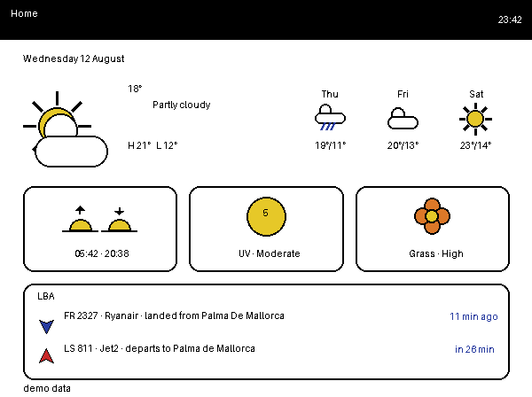
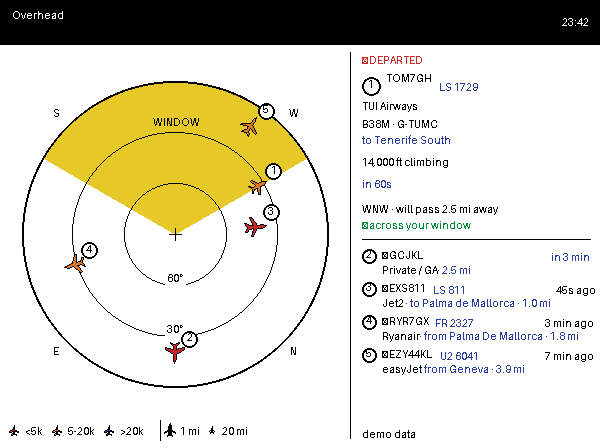
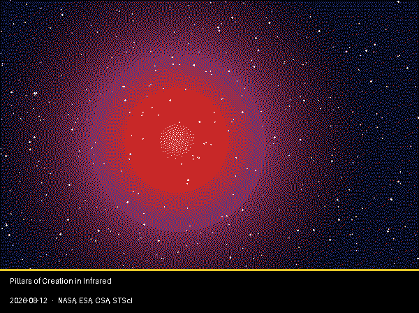

# inky-impression

Custom code for my Pimoroni 5.7" Inky Impression, driven by a Raspberry Pi.
Physical buttons A-D switch between small "apps" (a daily summary, a NASA
photo of the day, and live Leeds Bradford arrivals/departures); an on-screen
"detail" button shows a second, more detailed view of whatever's up.

## Screenshots

Demo-mode renders (`INKYAPPS_DEMO=1 python preview.py <app>`) — synthetic
data, no network calls or real keys needed. Real output looks the same,
just with your actual weather, flights, and photo of the day.

| Home (button A) | Planes (button B) | APOD (button C) |
|---|---|---|
|  |  |  |

## Hardware / display

- Pimoroni Inky Impression 5.7" — 600x448, 7-colour e-ink.
- Raspberry Pi with the four edge buttons wired per Pimoroni's examples
  (`inkyapps/buttons.py`, BCM pins A=5, B=6, C=16, D=24).
- A colour refresh takes ~30s and the panel dislikes being hammered, so all
  panel writes go through a single worker thread that coalesces requests
  (`inkyapps/display.py`).

## Setup

Dependencies: `Pillow`, `requests`, `gpiod`, `gpiodevice`, and Pimoroni's
`inky` library (there's no `requirements.txt` yet — install these plus
whatever the `inky` package pulls in).

1. Copy the project onto the Pi. If you download/transfer files as a flat
   folder, run `bash organise.sh` first — it sorts them back into the
   top-level / `inkyapps/` / `inkyapps/apps/` layout Python needs.
2. Copy `keys.example.py` to `keys.py` and fill in your own API key(s)
   (see [Keys & secrets](#keys--secrets-keyspy) below).
3. Edit `config.py` for everything else (button mapping, etc).
4. Run `python selftest.py` to check the panel and confirm the on-screen
   button legend matches your physical buttons (adjust `BUTTON_STRIP` in
   `config.py` if not).
5. Run `python doctor.py` — a fast, no-hardware pre-flight check that
   imports every module, checks config keys, and renders each registered
   app with demo data. Run this after any file changes before touching the
   real panel.
6. Run the app: `python run.py`. It's meant to run under systemd for an
   always-on display (no unit file is checked in yet — write one that runs
   `python run.py` and restart with `sudo systemctl restart inkyapps` once
   you have).

## Day-to-day dev tools

- `python preview.py <app>` — renders an app straight to
  `preview-<app>.png` without touching the panel. Use this to iterate on
  layout; a real refresh costs 30s and panel lifetime.
- `python doctor.py` — pre-flight sanity check (see above).
- `python selftest.py` / `python selftest.py --preview` — test card to
  check panel wiring and button-to-legend alignment.
- `python -m inkyapps.buttons` — print raw button presses, nothing else.

## Apps

Registered in `inkyapps/apps/__init__.py`; only registered apps are
imported, so a broken unregistered module can't break a run.

- **home** (button A, also the morning app — see `MORNING_APP` below) — a
  daily summary: date, weather (plus a few days ahead), sunrise/sunset, UV
  index, pollen, and the last/next Leeds Bradford movement. Redraws every 10
  minutes while on screen; pressing A again refreshes it on demand, same as
  any button. See "The home screen" below for where its data comes from. No
  detail view.
- **apod** (button C) — NASA Astronomy Picture of the Day, with a detail
  view (button D) for the full description.
- **planes** (button B) — live arrivals/departures at Leeds Bradford (LBA),
  and *only* LBA — see below for why. A background thread
  (`inkyapps/tracker.py`) polls airplanes.live continuously so the button
  press always has an answer ready, rather than fetching (and finding empty
  sky) on demand. No detail view.
- A `serve.py` exposing the same renders as JPEGs over HTTP, for a
  battery-powered Inky Frame to pull, is planned (`SERVE_HOST`/`SERVE_PORT`
  in `config.py`) but not built yet.

### The home screen

Full-bleed, no button legend — a hand-drawn weather icon plus temperature,
a `FORECAST_DAYS`-day mini forecast strip filling the whitespace beside it,
three rounded-rect stat tiles (sunrise/sunset, UV, pollen), and a flight
card, rather than a plain stacked list. The icons (`_icon_weather`,
`_icon_sun_arrow`, `_icon_badge`, `_icon_flower`, `_icon_plane` in
`home.py`) are hand-drawn shapes in the same spirit as the planes app's
aircraft silhouette — flat fills, no bitmap assets.

`inkyapps/apps/home.py` doesn't fetch anything itself for the flight data —
it just reads whatever `inkyapps/fids.py`'s shared `BOARD` singleton
currently holds. That board is kept warm in the background by the planes
app's tracker (which starts at boot regardless of whether button B is even
mapped), so the home screen's flight strip costs zero extra AeroDataBox
requests of its own.

Because it reads the board directly rather than the live-tracked aircraft
the planes app uses, `BOARD.last_and_next()` only ever considers entries
AeroDataBox has flagged `live` (an actual aircraft assigned, not just a
timetable slot) — a schedule-only entry's time is the published timetable,
not a confirmed movement, and "departed 8 min ago" off a delayed slot would
be actively misleading rather than just imprecise. This means the two
screens can legitimately disagree: the home screen can show nothing even
when planes has live traffic in range (nothing confirmed on the board yet),
or vice versa (something confirmed on the board that's drifted outside the
planes app's tracking radius or memory window).

Weather/sun/UV/pollen come from `inkyapps/weather.py`, via Open-Meteo — free
and keyless, so no quota to manage, but still cached for
`WEATHER_REFRESH_MINUTES` since conditions don't change every 10 minutes.
Pollen is the CAMS European model, so it only covers Europe; the on-screen
level is a rough low/moderate/high/very-high bucketing of the raw
concentration, not a clinical figure.

### Why the planes app is LBA-only

An earlier version of this tracked all aircraft within 25nm and identified
them by looking up routes via **callsign** — but callsigns get recycled and
reassigned mid-flight, so that lookup regularly answered for the wrong
flight. This version only shows aircraft using Leeds Bradford, identified by
joining live ADS-B position data to the airport's own arrivals/departures
board (AeroDataBox) on **Mode-S hex** — a fixed per-airframe ID that never
changes — instead of callsign. The board entry itself then carries the real
flight number, airline, and route, so no separate route lookup is needed at
all. Private/GA aircraft that never appear on the board are still shown,
labelled "Private / GA", if they're plainly low and close to the field.

**Quota note:** the airport board is the only thing here that costs
AeroDataBox requests (live tracking via airplanes.live is free/unlimited
enough at this scale). `FIDS_REFRESH_MINUTES` defaults to a conservative 4
hours because the monthly quota was nearly exhausted as of 2026-08-12 —
worth shortening once you know how quickly it actually refills.

## Key config (`config.py`)

Edit and `sudo systemctl restart inkyapps` to apply. Highlights:

**Buttons**
- `BUTTON_APPS` — maps `"A"`/`"B"`/`"C"`/`"D"` to app names from the
  registry (`None` = unmapped). Currently A = home, B = planes, C = apod.
- `STARTUP_APP` — app shown when the service starts (`None` = leave
  whatever's already on the panel, since e-ink holds its image unpowered).
  Currently `"apod"`.
- `MORNING_APP` / `MORNING_TIME` — once a day at `MORNING_TIME` (24h
  `"HH:MM"`, local), switch to `MORNING_APP` regardless of what's currently
  on screen — e.g. so the day's new APOD picture is already up when you sit
  down at your desk. `MORNING_APP = None` disables it. Currently `"apod"`
  at `"06:00"`.
- `DETAIL_BUTTON` — which button shows the current app's detail view
  (`""` to disable). Currently `"D"`.
- `BUTTON_STRIP` — `"left"`/`"bottom"`/`"right"`, whichever edge your
  buttons are physically on, so the on-screen legend lines up.
- `HOLD_D_TO_SHUTDOWN` — hold D for 5s to `sudo poweroff` cleanly.

**APOD app**
- `NASA_API_KEY` — lives in `keys.py`, not here (see
  [Keys & secrets](#keys--secrets-keyspy) below).
- `CACHE_DIR` — where downloaded pictures/API responses are cached
  (default `~/.cache/inkyapps`).
- `APOD_SATURATION` / `APOD_CONTRAST` — pushed before dithering, since
  e-ink has no backlight and looks flatter than a monitor.
- `APOD_FIT` — `"smart"` (crop near-panel shapes, letterbox extreme ones),
  `"fill"` (always crop), or `"contain"` (always letterbox).
- `APOD_ASPECT_TOLERANCE` — how far off-panel-shape `"smart"` will still
  crop rather than letterbox.

**Planes app**
- `HOME_AIRPORT_IATA` / `HOME_AIRPORT_ICAO` / `HOME_AIRPORT_LAT` /
  `HOME_AIRPORT_LON` — identifies your airport (default: LBA/EGNM, Leeds
  Bradford).
- `HOME_AIRPORT_RADIUS_NM` / `HOME_AIRPORT_MAX_ALT_FT` — how close/low
  counts as "using the airport", for aircraft the board doesn't know about.
- `SEARCH_RADIUS_NM` — how far out to look for live aircraft, centred on
  you. Only needs to cover final approach/initial climb, not general
  overhead traffic.
- `PLANES_POLL_SECONDS` / `PLANES_MEMORY_MINUTES` — live-tracking poll rate
  and how long an aircraft is remembered after it's gone (airplanes.live is
  free, so this can stay frequent).
- `MIN_ELEVATION_DEG` / `MAX_POSITION_AGE_S` — position sanity filters.
- `WINDOW_FOV_DEG` — how much sky your window shows either side of
  `WINDOW_BEARING` (in `keys.py`).
- `FIDS_REFRESH_MINUTES` / `FIDS_WINDOW_HOURS` / `FIDS_OFFSET_MINUTES` —
  airport board polling. **This is the only AeroDataBox-quota-costing
  setting in the app** — see "Why the planes app is LBA-only" above.
- `PLANES_MAX_SHOWN` / `PLANES_MAX_PAST` / `PLANES_MIN_UPCOMING` — how the
  upcoming/recently-past split divides the screen.
- `PLANES_LIST_STYLE` — `"compact"` (one line per flight) or `"detailed"`
  (two lines, fewer flights fit).
- `DISTANCE_UNIT` — `"mi"`, `"nm"`, or `"km"` for on-screen distances
  (`SEARCH_RADIUS_NM`/`HOME_AIRPORT_RADIUS_NM` stay in nautical miles
  regardless — the ADS-B API expects them that way).

**Home screen**
- `WEATHER_REFRESH_MINUTES` — how often `inkyapps/weather.py` re-fetches
  weather/UV/pollen from Open-Meteo. Free and keyless, so this is about
  avoiding pointless requests rather than managing a budget.
- `FORECAST_DAYS` — how many days ahead the mini forecast strip shows,
  beside the current-conditions block. Today's own weather is always the
  big block, regardless of this setting.

**Display / server**
- `SATURATION` — global saturation for photographic (RGB) renders; UI
  screens use exact palette indices and ignore it.
- `MIN_REFRESH_INTERVAL_S` — minimum gap between panel refreshes.
- `SERVE_HOST` / `SERVE_PORT` — for the planned `serve.py` HTTP server
  (not built yet).

## Keys & secrets (`keys.py`)

API keys and anything else identifying are kept out of `config.py` and out
of git entirely, in `keys.py`. It's listed in `.gitignore`, so it's never
committed — `config.py` just imports from it.

    cp keys.example.py keys.py

Then edit `keys.py` and fill in:

- `NASA_API_KEY` — free/instant at https://api.nasa.gov (`DEMO_KEY` works
  but is heavily rate-limited).
- `AERODATABOX_KEY` — free tier at
  https://rapidapi.com/aedbx-aedbx/api/aerodatabox, for the planes app's
  airport board.
- `LATITUDE` / `LONGITUDE` / `OBSERVER_ALT_M` — your position (decimal
  degrees, rough height above sea level in metres). Used by the planes app
  to work out what's visible from where you are, and by the home screen for
  local weather/sun/UV/pollen.
- `WINDOW_BEARING` — which way your window faces, in degrees true north
  (0=N, 90=E, 180=S, 270=W). Stand at the window with a phone compass and
  read off the bearing you're facing. `None` disables the "in view"
  indicator on the planes app.

`python doctor.py` checks `keys.py` exists (and that the keys aren't still
placeholders) before it lets you run anything else.
